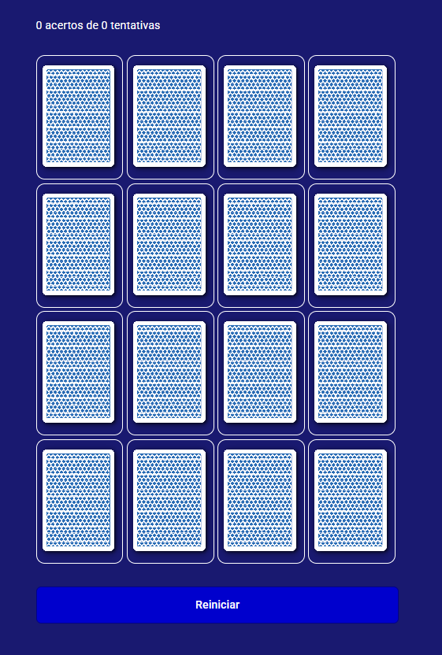

# 🧠 Projeto Quiz Interativo

📘 Projeto de estudo | Desafio prático de JavaScript

Projeto desenvolvido em HTML, CSS e JavaScript puro, como desafio prático para treinar manipulação do DOM, eventos, estrutura de dados e lógica de programação.

## 🎯 Funcionalidades

- Perguntas com múltiplas alternativas
- Feedback de resposta correta/incorreta
- Contagem de pontos
- Reinício do quiz
- Responsivo para dispositivos móveis

## 💻 Tecnologias Utilizadas

- HTML5
- CSS3 (com responsividade)
- JavaScript (DOM, eventos, lógica)

## 📸 Imagem do Projeto

## 🚀 Deploy

Acesse o projeto online:  
👉 [Clique aqui para visualizar](https://antoniobreis.github.io/quizinterativo/)

## 👨‍💻 Autor

Desenvolvido por [**Antonio Breis**](https://github.com/antoniobreis) 🚀 